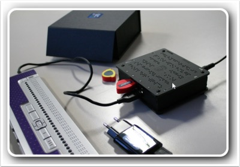

# BraillePi

De BraillePi is een kleine computer om Braille te leren thuis of op school. De student leert Braille door stap voor stap door oefeningen te gaan. Op elk moment kan de gebruiker horen wat er op de brailleleesregel staat door een knopje boven een braillecel in te drukken.

Voor kinderen worden letters phonetisch uitgesproken en voor ouderen wordt de letter omschreven, zo is de g (punt 1,2,4,5) een kussentje.

## Begeleider

* [handleiding](begeleider.md)
* [betekenis toetsen](betekenistoetsen.md)

### Basis-bestanden

De braillepi start standaard op met een basisbestand. Ben je deze kwijt download ze dan en zet ze op een usb-stick. Door deze in een braillepi te steken wanneer deze aan staat zal de braillepi weer in zijn originele staat komen.

* [braille basis ZIP](downloads/braillepi_basis/braillepi_basis.zip)
* [word](downloads/braillepi_basis/word.txt)

## Gebruiker

* [gebruiker](gebruiker.md)

## Aanvankelijk
Aanleren van letters alfabet voor kinderen die leren lezen en schrijven.

* [met punt op pad](met_punt_op_pad.md)

<!--
* [rekenwerkbladen](rekenwerkbladen.md)
* -->

## Revalidatie

* [Maréchal BraillePi](revalidatie_marechal.md)
* [Bartiméus BraillePi](revalidatie_bartimeus.md)
* [teksten](teksten.md)

